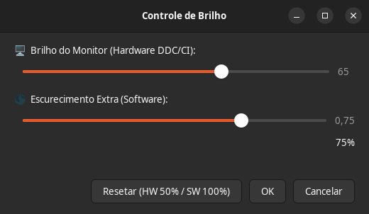
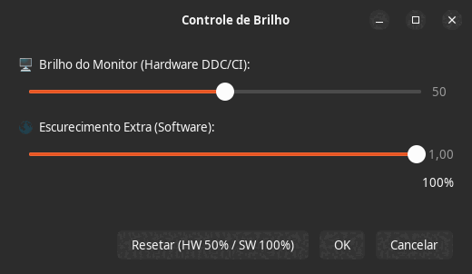

# Brightness Control 🖥️🌙

## 🐳 Instalação e Execução (Docker) — recomendado

### Pré-requisitos
- [Docker](https://docs.docker.com/get-docker/) + Docker Compose

### Rodar com Docker
```bash
docker compose up --build
```
App desktop — container não é o fluxo recomendado.

### Sem Docker (local)
```bash
# App desktop Linux (X11)
./brightness-gui
```

> Controle de brilho para monitores externos no Linux via **DDC/CI** (hardware) + **xrandr** (software dimming)


---

## ✨ Funcionalidades

| Recurso | Descrição |
|---------|-----------|
| 🖥️ **Hardware (DDC/CI)** | Controla o backlight real do monitor (0-100%) |
| 🌑 **Software (xrandr)** | Escurecimento por GPU — **vai além do zero do hardware** |
| 🎚️ **Live preview** | Arraste o slider → brilho muda em tempo real |
| ⚡ **Debounce inteligente** | Hardware coalescido e software com debounce de 150ms, sem travar a UI |
| 🔄 **Restaura ao cancelar** | Cancelar ou fechar a janela → volta ao brilho original |
| ⌨️ **Atalhos via CLI** | `--adjust-hw`, `--toggle-sw` e `--restore-last` sem abrir a janela |
| 💾 **Persistência** | Últimos valores salvos em `~/.config/brightness-control/config.json` |
| 📱 **Interface nativa GTK3** | Integrada ao desktop, aparece no menu de aplicativos |

---

## 📸 Capturas de Tela

### Interface Principal


### Demo Animado


---

## 🚀 Instalação Rápida

### Pré-requisitos
```bash
# Ubuntu / Debian / Mint / Pop!_OS
sudo apt update && sudo apt install -y ddcutil python3-gi gir1.2-gtk-3.0

# Arch / Manjaro
sudo pacman -S ddcutil python-gobject gtk3

# Fedora
sudo dnf install ddcutil python3-gobject gtk3
```

> **Importante:** Seu monitor precisa suportar **DDC/CI** (a maioria dos monitores modernos suporta). Verifique no menu do monitor (OSD) se "DDC/CI" está **ativado**.

### Instalação
```bash
# Clone o repositório
git clone https://github.com/FrancosCorporation/brightness-control.git
cd brightness-control

# Torne executável
chmod +x brightness-gui

# Instale system-wide (opcional, requer sudo)
sudo cp brightness-gui /usr/local/bin/
sudo cp brightness-control.desktop /usr/share/applications/

# Ou use localmente
./brightness-gui
```

---

## 🎮 Como Usar

1. Abra **"Controle de Brilho"** no menu de aplicativos
2. **Slider superior (🖥️ Hardware)** — Controla o backlight físico do monitor
3. **Slider inferior (🌑 Software)** — Escurecimento extra via GPU (útil à noite)
4. Arraste → brilho muda **ao vivo**
5. **OK** para confirmar / **Cancelar** para restaurar original

### Atalhos de Teclado (opcional)
Adicione em *Configurações → Teclado → Atalhos*:
```bash
# Aumentar brilho hardware +10
brightness-gui --adjust-hw +10

# Diminuir brilho hardware -10
brightness-gui --adjust-hw -10

# Toggle software dimming (100% <-> último valor, padrão 50%)
brightness-gui --toggle-sw

# Restaurar os últimos valores salvos (ex.: no autostart)
brightness-gui --restore-last
```

> Os valores de hardware/software são salvos ao clicar em **OK** ou ao usar as
> opções de CLI. O `--toggle-sw` lembra o último nível de escurecimento usado.

---

## ⚙️ Configuração Avançada

### Permitir usuário acessar I2C (sem sudo no ddcutil)
```bash
sudo usermod -aG i2c $USER
# Reinicie a sessão
```

### Monitores específicos
Os monitores são detectados automaticamente (`ddcutil detect`). Se algum
monitor não for desejado, filtre a lista em `detect_displays()` no
`brightness-gui`.

### Inicialização automática
Crie `~/.config/autostart/brightness-control.desktop`:
```ini
[Desktop Entry]
Type=Application
Name=Brightness Restore
Exec=brightness-gui --restore-last
Hidden=false
```

---

## 🐛 Solução de Problemas

| Problema | Solução |
|----------|---------|
| "Nenhum monitor DDC/CI detectado" | Ative DDC/CI no OSD do monitor; use cabo DisplayPort/HDMI (não VGA); `sudo modprobe i2c-dev` |
| Brilho não muda | `ddcutil detect` — veja se lista seus monitores; tente `sudo ddcutil setvcp 10 50 --display 1` |
| Delay no slider | Normal em monitores lentos — o debounce de 150ms evita flood de comandos |
| Dois monitores, um não responde | Alguns monitores não suportam DDC/CI via HDMI — tente DisplayPort |

---

## 🛠️ Arquitetura

```
brightness-gui (Python/GTK3, arquivo único)
├── Backend
│   ├── DDC/CI via ddcutil — setvcp/getvcp 10 (VCP 0x10 = Brightness)
│   └── xrandr --brightness — gamma ramp via X11
├── Parsers puros e testáveis (detect / getvcp / xrandr --verbose)
├── CLI: --adjust-hw, --toggle-sw, --restore-last
│   └── Config em ~/.config/brightness-control/config.json
└── GTK3 UI
    ├── Gtk.Scale duplo (hardware + software)
    ├── Worker de hardware coalescido (thread + lock)
    ├── Debounce de 150ms no software
    └── Cancelar/fechar restaura os valores originais
```

---

## 🧪 Testes

```bash
python3 -m unittest discover -s tests -v
```

Os parsers e as ações de CLI são testados sem precisar de GTK nem de monitores
físicos. O fluxo da janela tem um smoke test que usa Xvfb e é pulado
automaticamente quando não há display. O CI roda `py_compile` + testes em cada
push/PR.

---

## 📦 Empacotamento

### .deb (Ubuntu/Debian)
```bash
# Estrutura
brightness-control_1.0.0/
├── DEBIAN/control
├── usr/local/bin/brightness-gui
└── usr/share/applications/brightness-control.desktop

dpkg-deb --build brightness-control_1.0.0
```

### Flatpak / Snap / AppImage
Contribuições bem-vindas! 🎉

---

## 🤝 Contribuindo

1. Fork o projeto
2. Crie branch: `git checkout -b feature/nova-funcionalidade`
3. Commit: `git commit -m 'feat: adiciona X'`
4. Push: `git push origin feature/nova-funcionalidade`
5. Abra Pull Request

### Ideias para PRs
- [ ] Perfil por monitor (salvar/restaurar configurações)
- [ ] Integração com `redshift`/`gammastep` (temperatura de cor)
- [ ] AppIndicator / System Tray
- [ ] Wayland nativo (wlr-gamma-control-unstable-v1)
- [ ] Empacotamento Flatpak/Snap

---

## 📄 Licença

MIT License — veja [LICENSE](LICENSE) para detalhes.

---

## ⭐ Créditos

- **ddcutil** — [rockowitz/ddcutil](https://github.com/rockowitz/ddcutil)
- **GTK3** — The GTK Team
- Inspirado em ferramentas como `brightnessctl`, `ddcui`, `monitorcontrol`

---

## 💬 Suporte

- **Issues**: [GitHub Issues](https://github.com/FrancosCorporation/brightness-control/issues)
- **Discussões**: [GitHub Discussions](https://github.com/FrancosCorporation/brightness-control/discussions)

---

<div align="center">

**Feito com ☕ para quem trabalha tarde da noite**

[⬆ Voltar ao topo](#brightness-control-)

</div>
